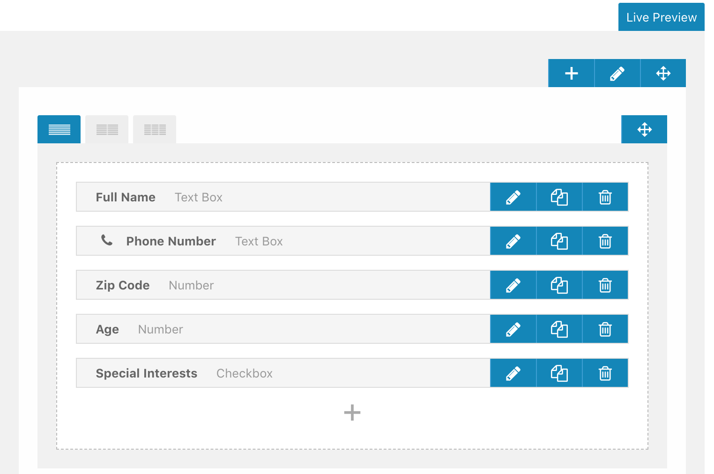
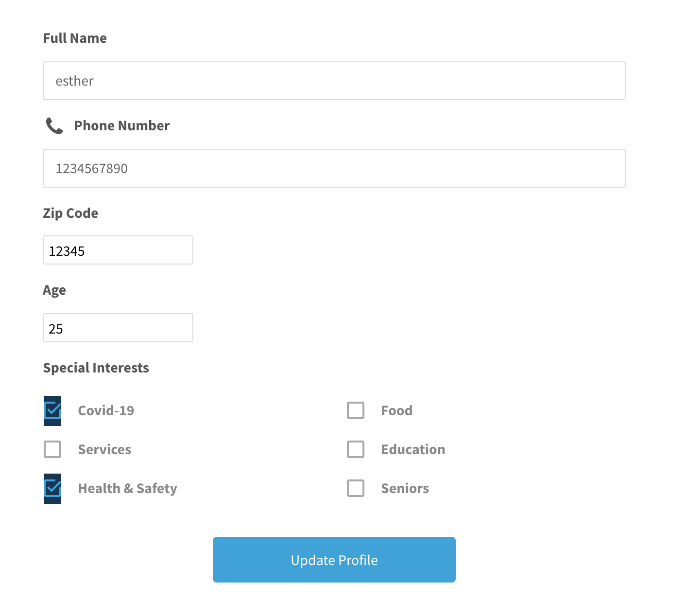
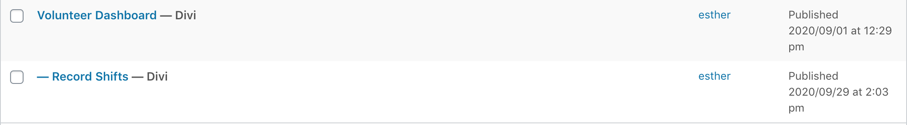

# CalVol Volunteer Profiles

This plugin implements site-specific functionality for volunteer profiles on the [californiavolunteers](https://www.californiavolunteers.ca.gov/) website.

### Included functionality
- User account creation when the "Get Involved" form is submitted
- Shortcodes for populating the volunteer dashboard
- Redirection back to the volunteer dashboard after editing the profile

## Setting up volunteer profiles
Volunteer profiles are implemented via a combination of new WordPress pages, the [UltimateMember plugin](https://ultimatemember.com/), and this plugin. The steps for adding volunteer profiles are
1. Install and set up UltimateMember
1. Install the calvol-volunteer-profiles plugin
1. Install the [WordPress Importer](https://wordpress.org/plugins/wordpress-importer/) plugin
1. Import pages from the `page-exports` directory

### Install and set up UltimateMember
UltimateMember will generate default account-related pages for you. The ones you should keep are:
1. Login
1. Logout
1. Register
1. Password Reset
1. User

Delete the other auto-generated pages.

Under UltimateMember: User Roles, create a new "volunteer" user role. This will be used to create wordpress users who are volunteers as opposed to admins or editors.

Under UltimateMember: Forms, update the default profile form to have the following fields and field types:

{ width = 50% }

The form should look like this when displayed on a page:

{ width = 50% }

### Install the calvol-volunteer-profiles plugin
Download this repo as a zip file and upload it to the wordpress site.

### Install the [WordPress Importer](https://wordpress.org/plugins/wordpress-importer/) plugin
Install this plugin from the plugin page in the admin dashboard.

### Import pages from the page-exports directory
From the Tools: Import page, you can upload the XML file in `page-exports`. Afterward, you should see two new pages: *Volunteer Dashboard* and *-- Record Shifts*.

