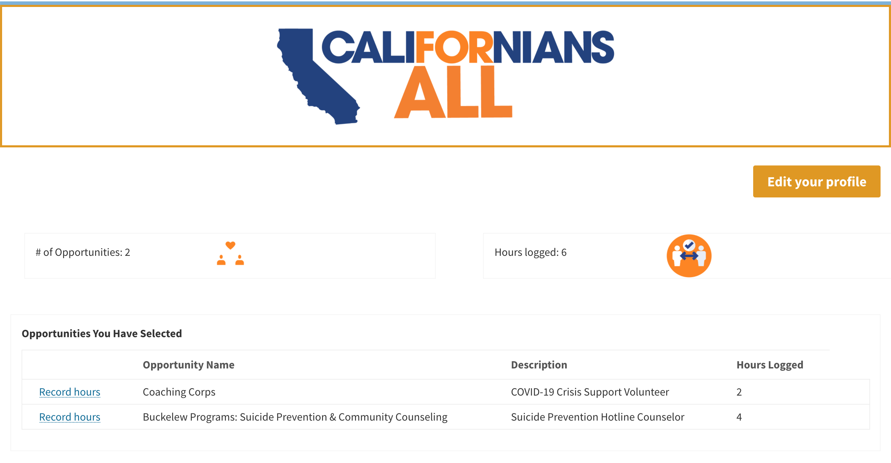

# CalVol Volunteer Profiles

This plugin implements site-specific functionality for volunteer profiles on the [californiavolunteers](https://www.californiavolunteers.ca.gov/) website.

### Functionality needed for volunteer profiles
- Backend user creation when contact form (ID 49343) is submitted
- Login and logout pages
- Edit profile page
- Emailing the user a temporary password and a link to reset their password
- Password reset page
- Volunteer dashboard page
- Form to record the hours volunteered

### Functionality included in this plugin
- User account creation when the "Get Involved" form is submitted
- Shortcodes for populating the volunteer dashboard

## Setting up volunteer profiles
Volunteer profiles are implemented via a combination of new WordPress pages, the [UltimateMember plugin](https://ultimatemember.com/), and this plugin. The steps for adding volunteer profiles are
1. Install and set up UltimateMember
1. Install the calvol-volunteer-profiles plugin
1. Install the [WordPress Importer](https://wordpress.org/plugins/wordpress-importer/) plugin
1. Import pages from the `page-exports` directory
1. Enable user creation from the CalVol Volunteer Profiles plugin settings page

### Install and set up UltimateMember
UltimateMember will generate several default account-related pages for you. The ones you should keep are:
1. Login
1. Logout
1. Register
1. Password Reset
1. User

Delete the other auto-generated pages.

Under UltimateMember: User Roles, create a new "volunteer" user role. This will be used to create wordpress users who are volunteers as opposed to admins or editors.

Under UltimateMember: Forms, update the default profile form to have the following fields and field types:

The form should look like this when displayed on a page:

### Install the calvol-volunteer-profiles plugin
Download this repo as a zip file and upload it to the wordpress site.

### Install the [WordPress Importer](https://wordpress.org/plugins/wordpress-importer/) plugin
Install this plugin from the plugin page in the admin dashboard.

### Import pages from the page-exports directory
From the Tools: Import page, you can upload the XML file in `page-exports`. Afterward, you should see two new pages: *Volunteer Dashboard* and *-- Record Shifts*.

### Enable user creation from the CalVol Volunteer Profiles settings page
Since volunteer profile creation is user-facing functionality (it emails volunteers the temporary to their account), this functionality is gated behind a plugin setting. It can be enabled from the plugin settings page.

Access the CalVol Volunteer Profiles plugin settings in the sidebar of the admin dashboard.

This will take you to the plugin settings page, where you can enable account creation.

## Testing
You should now be able to fill out the form at [https://www.californiavolunteers.ca.gov/get-involved/covid-19/signup/](https://www.californiavolunteers.ca.gov/get-involved/covid-19/signup/), receive a temporary password, and use those credentials to log in at [https://www.californiavolunteers.ca.gov/login](https://www.californiavolunteers.ca.gov/login). After logging in, you'll be redirected to the dashboard page at [https://www.californiavolunteers.ca.gov/volunteer-dashboard](https://www.californiavolunteers.ca.gov/volunteer-dashboard).

